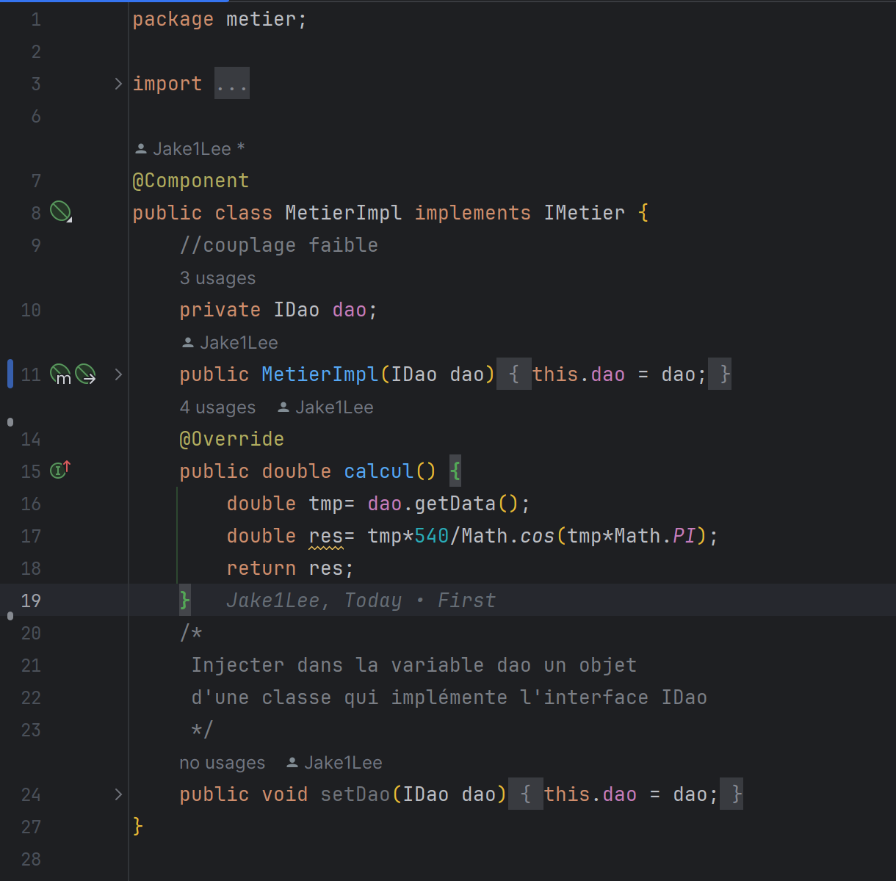

# mundia-ioc-2

 Réalisé par Mohammed Amine Farid

# Rapport de l'inversion de contrôle

## Création de l'interface IDao

## Création d'une implémentation de l'interface IDao version Base de Données

## Création d'une implémentation de l'interface IDao (version BD)

## Création de l'interface IMetier

## Création d'une implémentation de l'interface IMetier

## Instantiation statique

## Instantiation dynamique

## Injection des dépendances en utilisant config.xml

Ajouter les dependance en premier lieu

## Instantiation avec spring xml

## Instantiation avec annotations

